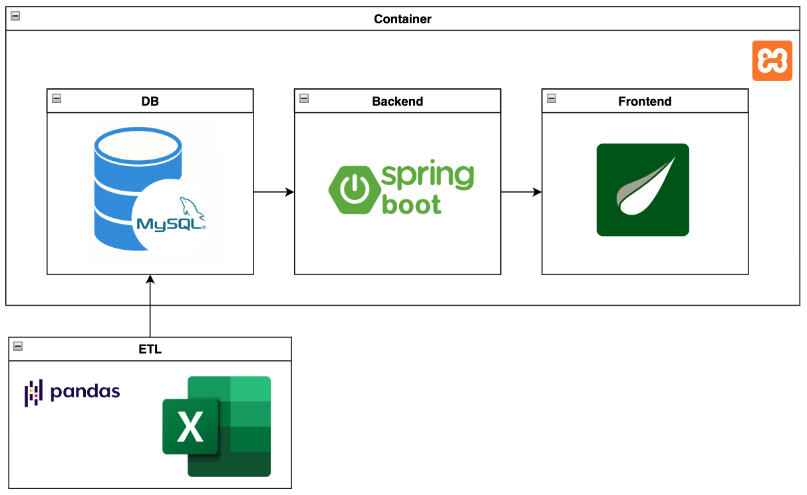

# CRUD WebApp

El proyecto es una aplicación web CRUD desarrollada con Java, Spring Boot, Thymeleaf y MySQL. Gestiona el inventario de materiales, incluyendo entradas, salidas, pedidos y solicitudes pendientes. Los datos históricos se cargan con Python y Pandas desde un archivo Excel.

### Organización del Proyecto

1. **crud-web-app**: Contiene el código fuente de la WebApp en Java, incluyendo los archivos de configuración y recursos.

2. **etl**: Almacena los módulos de Python encargados de la carga de datos históricos a la base de datos.

3. **misc**: Contiene archivos varios como los scripts DDL, consultas SQL y otros archivos auxiliares.

4. **pictures**: Almacena imágenes del proyecto, como diagramas, capturas de pantalla y otros gráficos visuales.

### Diagrama de Arquitectura

### Componentes del Sistema:

Este sistema se desarrolló en Java 21, utilizando las siguientes tecnologías.

1. MySQL (DB): Sistema de gestión de bases de datos relacional de código abierto.

2. Spring Boot (Backend): Gestiona la lógica de negocio y las peticiones del usuario, interactuando con la base de datos para procesar y devolver los datos requeridos por el frontend.

3. Thymeleaf (Frontend): Es un motor de plantillas Java para generar contenido dinámico en aplicaciones web, con sintaxis similar a HTML.

A su vez, se utilizó XAMPP para la ejecución local del sistema. Por último, se utilizó Python 3.11 con Pandas para la carga inicial de datos históricos. 

### Flujo de Datos:

- La carga inicial de datos históricos, alojados en un archivo Excel, se realizará a traves de Python utilizando Pandas.
- El **Frontend** se comunica con el **Backend** para enviar y recibir información.
- El **Backend** realiza las operaciones necesarias sobre la **Base de Datos** (MySQL) y procesa la información.
- Finalmente, el **Backend** devuelve los resultados al **Frontend**, que los presenta al usuario.

### DDLs

 
Definiciones:

1. inventario\_salidas: Registra las salidas de materiales del inventario, con detalles del departamento, cantidad y persona que recibió el material.

2. inventario\_entradas: Almacena los materiales entrantes, con información del proveedor, cantidad y notas.

3. control\_inventario: Lleva el control de materiales por categoría (oficina, intendencia, consumibles, mantenimiento) y sus cantidades.

4. pedidos: Registra los pedidos de materiales con su descripción, cantidad y fecha.

5. material\_pendiente\_requisicion: Almacena las solicitudes de materiales pendientes, incluyendo nombre, solicitante, departamento y fecha.

